# Projects and dependencies analysis

This document provides a comprehensive overview of the projects and their dependencies in the context of upgrading to .NETCoreApp,Version=v10.0.

## Table of Contents

- [Executive Summary](#executive-Summary)
  - [Highlevel Metrics](#highlevel-metrics)
  - [Projects Compatibility](#projects-compatibility)
  - [Package Compatibility](#package-compatibility)
  - [API Compatibility](#api-compatibility)
- [Aggregate NuGet packages details](#aggregate-nuget-packages-details)
- [Top API Migration Challenges](#top-api-migration-challenges)
  - [Technologies and Features](#technologies-and-features)
  - [Most Frequent API Issues](#most-frequent-api-issues)
- [Projects Relationship Graph](#projects-relationship-graph)
- [Project Details](#project-details)

  - [aspects\Cache\Aspects.Cache.csproj](#aspectscacheaspectscachecsproj)
  - [aspects\Freezable\Aspects.Freezable.csproj](#aspectsfreezableaspectsfreezablecsproj)
  - [aspects\Lazy\Aspects.Lazy.csproj](#aspectslazyaspectslazycsproj)
  - [aspects\Logging\Aspects.Logging.csproj](#aspectsloggingaspectsloggingcsproj)
  - [aspects\Notify\Aspects.Notify.csproj](#aspectsnotifyaspectsnotifycsproj)
  - [aspects\Universal\Aspects.Universal.csproj](#aspectsuniversalaspectsuniversalcsproj)
  - [src\AspectInjector.Analyzer\AspectInjector.Analyzer.csproj](#srcaspectinjectoranalyzeraspectinjectoranalyzercsproj)
  - [src\AspectInjector.Broker\AspectInjector.Broker.csproj](#srcaspectinjectorbrokeraspectinjectorbrokercsproj)
  - [src\AspectInjector.Core.Advice\AspectInjector.Core.Advice.csproj](#srcaspectinjectorcoreadviceaspectinjectorcoreadvicecsproj)
  - [src\AspectInjector.Core.Mixin\AspectInjector.Core.Mixin.csproj](#srcaspectinjectorcoremixinaspectinjectorcoremixincsproj)
  - [src\AspectInjector.Core\AspectInjector.Core.csproj](#srcaspectinjectorcoreaspectinjectorcorecsproj)
  - [src\AspectInjector.Rules\AspectInjector.Rules.csproj](#srcaspectinjectorrulesaspectinjectorrulescsproj)
  - [src\AspectInjector\AspectInjector.csproj](#srcaspectinjectoraspectinjectorcsproj)
  - [src\FluentIL.Common\FluentIL.Common.csproj](#srcfluentilcommonfluentilcommoncsproj)
  - [src\FluentIL\FluentIL.csproj](#srcfluentilfluentilcsproj)
  - [tests\AspectInjector.Analyzer.Tests\AspectInjector.Analyzer.Tests.csproj](#testsaspectinjectoranalyzertestsaspectinjectoranalyzertestscsproj)
  - [tests\AspectInjector.Tests.Generics\AspectInjector.Tests.Generics.csproj](#testsaspectinjectortestsgenericsaspectinjectortestsgenericscsproj)
  - [tests\AspectInjector.Tests.Integrity\AspectInjector.Tests.Integrity.csproj](#testsaspectinjectortestsintegrityaspectinjectortestsintegritycsproj)
  - [tests\AspectInjector.Tests.Runtime\AspectInjector.Tests.Runtime.csproj](#testsaspectinjectortestsruntimeaspectinjectortestsruntimecsproj)
  - [tests\AspectInjector.Tests.RuntimeAssets\AspectInjector.Tests.RuntimeAssets.csproj](#testsaspectinjectortestsruntimeassetsaspectinjectortestsruntimeassetscsproj)
  - [tests\AspectInjector.Tests.VBRuntime\AspectInjector.Tests.VBRuntime.vbproj](#testsaspectinjectortestsvbruntimeaspectinjectortestsvbruntimevbproj)
  - [tests\Aspects.Tests\Aspects.Tests.csproj](#testsaspectstestsaspectstestscsproj)

## Executive Summary

### Highlevel Metrics

| Metric | Count | Status |
| :--- | :---: | :--- |
| Total Projects | 22 | 10 require upgrade |
| Total NuGet Packages | 21 | 1 need upgrade |
| Total Code Files | 235 |  |
| Total Code Files with Incidents | 12 |  |
| Total Lines of Code | 17427 |  |
| Total Number of Issues | 20 |  |
| Estimated LOC to modify | 7+ | at least 0.0% of codebase |

### Projects Compatibility

| Project | Target Framework | Difficulty | Package Issues | API Issues | Est. LOC Impact | Description |
| :--- | :---: | :---: | :---: | :---: | :---: | :--- |
| [aspects\Cache\Aspects.Cache.csproj](#aspectscacheaspectscachecsproj) | netstandard2.0 | 🟢 Low | 0 | 1 | 1+ | ClassLibrary, Sdk Style = True |
| [aspects\Freezable\Aspects.Freezable.csproj](#aspectsfreezableaspectsfreezablecsproj) | netstandard2.0 | ✅ None | 0 | 0 |  | ClassLibrary, Sdk Style = True |
| [aspects\Lazy\Aspects.Lazy.csproj](#aspectslazyaspectslazycsproj) | netstandard2.0 | ✅ None | 0 | 0 |  | ClassLibrary, Sdk Style = True |
| [aspects\Logging\Aspects.Logging.csproj](#aspectsloggingaspectsloggingcsproj) | netstandard2.0 | 🟢 Low | 0 | 2 | 2+ | ClassLibrary, Sdk Style = True |
| [aspects\Notify\Aspects.Notify.csproj](#aspectsnotifyaspectsnotifycsproj) | netstandard2.0 | ✅ None | 0 | 0 |  | ClassLibrary, Sdk Style = True |
| [aspects\Universal\Aspects.Universal.csproj](#aspectsuniversalaspectsuniversalcsproj) | netstandard2.0 | ✅ None | 0 | 0 |  | ClassLibrary, Sdk Style = True |
| [src\AspectInjector.Analyzer\AspectInjector.Analyzer.csproj](#srcaspectinjectoranalyzeraspectinjectoranalyzercsproj) | netstandard2.0;netstandard2.1 | 🟢 Low | 1 | 4 | 4+ | ClassLibrary, Sdk Style = True |
| [src\AspectInjector.Broker\AspectInjector.Broker.csproj](#srcaspectinjectorbrokeraspectinjectorbrokercsproj) | netstandard2.0 | ✅ None | 0 | 0 |  | ClassLibrary, Sdk Style = True |
| [src\AspectInjector.Core.Advice\AspectInjector.Core.Advice.csproj](#srcaspectinjectorcoreadviceaspectinjectorcoreadvicecsproj) | netstandard2.0 | ✅ None | 0 | 0 |  | ClassLibrary, Sdk Style = True |
| [src\AspectInjector.Core.Mixin\AspectInjector.Core.Mixin.csproj](#srcaspectinjectorcoremixinaspectinjectorcoremixincsproj) | netstandard2.0 | ✅ None | 0 | 0 |  | ClassLibrary, Sdk Style = True |
| [src\AspectInjector.Core\AspectInjector.Core.csproj](#srcaspectinjectorcoreaspectinjectorcorecsproj) | netstandard2.0 | ✅ None | 0 | 0 |  | ClassLibrary, Sdk Style = True |
| [src\AspectInjector.Rules\AspectInjector.Rules.csproj](#srcaspectinjectorrulesaspectinjectorrulescsproj) | netstandard2.0 | ✅ None | 0 | 0 |  | ClassLibrary, Sdk Style = True |
| [src\AspectInjector\AspectInjector.csproj](#srcaspectinjectoraspectinjectorcsproj) | netstandard2.0 | ✅ None | 0 | 0 |  | ClassLibrary, Sdk Style = True |
| [src\FluentIL.Common\FluentIL.Common.csproj](#srcfluentilcommonfluentilcommoncsproj) | netstandard2.0 | ✅ None | 0 | 0 |  | ClassLibrary, Sdk Style = True |
| [src\FluentIL\FluentIL.csproj](#srcfluentilfluentilcsproj) | netstandard2.0 | ✅ None | 0 | 0 |  | ClassLibrary, Sdk Style = True |
| [tests\AspectInjector.Analyzer.Tests\AspectInjector.Analyzer.Tests.csproj](#testsaspectinjectoranalyzertestsaspectinjectoranalyzertestscsproj) | net8.0 | 🟢 Low | 0 | 0 |  | DotNetCoreApp, Sdk Style = True |
| [tests\AspectInjector.Tests.Generics\AspectInjector.Tests.Generics.csproj](#testsaspectinjectortestsgenericsaspectinjectortestsgenericscsproj) | net8.0 | 🟢 Low | 0 | 0 |  | ClassLibrary, Sdk Style = True |
| [tests\AspectInjector.Tests.Integrity\AspectInjector.Tests.Integrity.csproj](#testsaspectinjectortestsintegrityaspectinjectortestsintegritycsproj) | net8.0 | 🟢 Low | 0 | 0 |  | DotNetCoreApp, Sdk Style = True |
| [tests\AspectInjector.Tests.Runtime\AspectInjector.Tests.Runtime.csproj](#testsaspectinjectortestsruntimeaspectinjectortestsruntimecsproj) | net6.0;net8.0;net462;net481 | 🟢 Low | 1 | 0 |  | ClassLibrary, Sdk Style = True |
| [tests\AspectInjector.Tests.RuntimeAssets\AspectInjector.Tests.RuntimeAssets.csproj](#testsaspectinjectortestsruntimeassetsaspectinjectortestsruntimeassetscsproj) | netstandard2.0;net8.0;net6.0;net462;net481 | 🟢 Low | 1 | 0 |  | ClassLibrary, Sdk Style = True |
| [tests\AspectInjector.Tests.VBRuntime\AspectInjector.Tests.VBRuntime.vbproj](#testsaspectinjectortestsvbruntimeaspectinjectortestsvbruntimevbproj) | net6.0;net8.0 | 🟢 Low | 2 | 0 |  | ClassLibrary, Sdk Style = True |
| [tests\Aspects.Tests\Aspects.Tests.csproj](#testsaspectstestsaspectstestscsproj) | net8.0 | 🟢 Low | 0 | 0 |  | DotNetCoreApp, Sdk Style = True |

### Package Compatibility

| Status | Count | Percentage |
| :--- | :---: | :---: |
| ✅ Compatible | 20 | 95.2% |
| ⚠️ Incompatible | 1 | 4.8% |
| 🔄 Upgrade Recommended | 0 | 0.0% |
| ***Total NuGet Packages*** | ***21*** | ***100%*** |

### API Compatibility

| Category | Count | Impact |
| :--- | :---: | :--- |
| 🔴 Binary Incompatible | 0 | High - Require code changes |
| 🟡 Source Incompatible | 4 | Medium - Needs re-compilation and potential conflicting API error fixing |
| 🔵 Behavioral change | 3 | Low - Behavioral changes that may require testing at runtime |
| ✅ Compatible | 11434 |  |
| ***Total APIs Analyzed*** | ***11441*** |  |

## Aggregate NuGet packages details

| Package | Current Version | Suggested Version | Projects | Description |
| :--- | :---: | :---: | :--- | :--- |
| coverlet.collector | 8.0.1 |  | [Aspects.Tests.csproj](#testsaspectstestsaspectstestscsproj) | ✅Compatible |
| ErrorProne.NET.Structs | 0.1.2 |  | [AspectInjector.Analyzer.csproj](#srcaspectinjectoranalyzeraspectinjectoranalyzercsproj) [AspectInjector.Analyzer.Tests.csproj](#testsaspectinjectoranalyzertestsaspectinjectoranalyzertestscsproj) [AspectInjector.Broker.csproj](#srcaspectinjectorbrokeraspectinjectorbrokercsproj) [AspectInjector.Core.Advice.csproj](#srcaspectinjectorcoreadviceaspectinjectorcoreadvicecsproj) [AspectInjector.Core.csproj](#srcaspectinjectorcoreaspectinjectorcorecsproj) [AspectInjector.Core.Mixin.csproj](#srcaspectinjectorcoremixinaspectinjectorcoremixincsproj) [AspectInjector.csproj](#srcaspectinjectoraspectinjectorcsproj) [AspectInjector.Rules.csproj](#srcaspectinjectorrulesaspectinjectorrulescsproj) [AspectInjector.Tests.Generics.csproj](#testsaspectinjectortestsgenericsaspectinjectortestsgenericscsproj) [AspectInjector.Tests.Integrity.csproj](#testsaspectinjectortestsintegrityaspectinjectortestsintegritycsproj) [AspectInjector.Tests.Runtime.csproj](#testsaspectinjectortestsruntimeaspectinjectortestsruntimecsproj) [AspectInjector.Tests.RuntimeAssets.csproj](#testsaspectinjectortestsruntimeassetsaspectinjectortestsruntimeassetscsproj) [AspectInjector.Tests.VBRuntime.vbproj](#testsaspectinjectortestsvbruntimeaspectinjectortestsvbruntimevbproj) [Aspects.Cache.csproj](#aspectscacheaspectscachecsproj) [Aspects.Freezable.csproj](#aspectsfreezableaspectsfreezablecsproj) [Aspects.Lazy.csproj](#aspectslazyaspectslazycsproj) [Aspects.Logging.csproj](#aspectsloggingaspectsloggingcsproj) [Aspects.Notify.csproj](#aspectsnotifyaspectsnotifycsproj) [Aspects.Tests.csproj](#testsaspectstestsaspectstestscsproj) [Aspects.Universal.csproj](#aspectsuniversalaspectsuniversalcsproj) [FluentIL.Common.csproj](#srcfluentilcommonfluentilcommoncsproj) [FluentIL.csproj](#srcfluentilfluentilcsproj) | ✅Compatible |
| IsExternalInit | 1.0.3 |  | [AspectInjector.Analyzer.csproj](#srcaspectinjectoranalyzeraspectinjectoranalyzercsproj) [AspectInjector.Analyzer.Tests.csproj](#testsaspectinjectoranalyzertestsaspectinjectoranalyzertestscsproj) [AspectInjector.Broker.csproj](#srcaspectinjectorbrokeraspectinjectorbrokercsproj) [AspectInjector.Core.Advice.csproj](#srcaspectinjectorcoreadviceaspectinjectorcoreadvicecsproj) [AspectInjector.Core.csproj](#srcaspectinjectorcoreaspectinjectorcorecsproj) [AspectInjector.Core.Mixin.csproj](#srcaspectinjectorcoremixinaspectinjectorcoremixincsproj) [AspectInjector.csproj](#srcaspectinjectoraspectinjectorcsproj) [AspectInjector.Rules.csproj](#srcaspectinjectorrulesaspectinjectorrulescsproj) [AspectInjector.Tests.Generics.csproj](#testsaspectinjectortestsgenericsaspectinjectortestsgenericscsproj) [AspectInjector.Tests.Integrity.csproj](#testsaspectinjectortestsintegrityaspectinjectortestsintegritycsproj) [AspectInjector.Tests.Runtime.csproj](#testsaspectinjectortestsruntimeaspectinjectortestsruntimecsproj) [AspectInjector.Tests.RuntimeAssets.csproj](#testsaspectinjectortestsruntimeassetsaspectinjectortestsruntimeassetscsproj) [AspectInjector.Tests.VBRuntime.vbproj](#testsaspectinjectortestsvbruntimeaspectinjectortestsvbruntimevbproj) [Aspects.Cache.csproj](#aspectscacheaspectscachecsproj) [Aspects.Freezable.csproj](#aspectsfreezableaspectsfreezablecsproj) [Aspects.Lazy.csproj](#aspectslazyaspectslazycsproj) [Aspects.Logging.csproj](#aspectsloggingaspectsloggingcsproj) [Aspects.Notify.csproj](#aspectsnotifyaspectsnotifycsproj) [Aspects.Tests.csproj](#testsaspectstestsaspectstestscsproj) [Aspects.Universal.csproj](#aspectsuniversalaspectsuniversalcsproj) [FluentIL.Common.csproj](#srcfluentilcommonfluentilcommoncsproj) [FluentIL.csproj](#srcfluentilfluentilcsproj) | ✅Compatible |
| Microsoft.Build.Utilities.Core | 18.4.0 |  | [AspectInjector.csproj](#srcaspectinjectoraspectinjectorcsproj) | ✅Compatible |
| Microsoft.CodeAnalysis.Analyzers | 5.3.0 |  | [AspectInjector.Analyzer.csproj](#srcaspectinjectoranalyzeraspectinjectoranalyzercsproj) [AspectInjector.Analyzer.Tests.csproj](#testsaspectinjectoranalyzertestsaspectinjectoranalyzertestscsproj) | ✅Compatible |
| Microsoft.CodeAnalysis.CSharp.Workspaces | 5.3.0 |  | [AspectInjector.Analyzer.csproj](#srcaspectinjectoranalyzeraspectinjectoranalyzercsproj) [AspectInjector.Analyzer.Tests.csproj](#testsaspectinjectoranalyzertestsaspectinjectoranalyzertestscsproj) | ✅Compatible |
| Microsoft.CSharp | 4.7.0 |  | [AspectInjector.Core.csproj](#srcaspectinjectorcoreaspectinjectorcorecsproj) [FluentIL.csproj](#srcfluentilfluentilcsproj) | ✅Compatible |
| Microsoft.Extensions.Caching.Abstractions | 10.0.5 |  | [Aspects.Cache.csproj](#aspectscacheaspectscachecsproj) | ✅Compatible |
| Microsoft.Extensions.Caching.Memory | 10.0.5 |  | [Aspects.Cache.csproj](#aspectscacheaspectscachecsproj) | ✅Compatible |
| Microsoft.Extensions.Logging | 10.0.5 |  | [Aspects.Logging.csproj](#aspectsloggingaspectsloggingcsproj) | ✅Compatible |
| Microsoft.Extensions.Logging.Console | 10.0.5 |  | [Aspects.Logging.csproj](#aspectsloggingaspectsloggingcsproj) | ✅Compatible |
| Microsoft.NET.Test.Sdk | 18.3.0 |  | [AspectInjector.Analyzer.Tests.csproj](#testsaspectinjectoranalyzertestsaspectinjectoranalyzertestscsproj) [AspectInjector.Tests.Integrity.csproj](#testsaspectinjectortestsintegrityaspectinjectortestsintegritycsproj) [AspectInjector.Tests.Runtime.csproj](#testsaspectinjectortestsruntimeaspectinjectortestsruntimecsproj) [AspectInjector.Tests.VBRuntime.vbproj](#testsaspectinjectortestsvbruntimeaspectinjectortestsvbruntimevbproj) [Aspects.Tests.csproj](#testsaspectstestsaspectstestscsproj) | ✅Compatible |
| Microsoft.NETFramework.ReferenceAssemblies | 1.0.3 |  | [AspectInjector.Tests.Runtime.csproj](#testsaspectinjectortestsruntimeaspectinjectortestsruntimecsproj) [AspectInjector.Tests.RuntimeAssets.csproj](#testsaspectinjectortestsruntimeassetsaspectinjectortestsruntimeassetscsproj) [AspectInjector.Tests.VBRuntime.vbproj](#testsaspectinjectortestsvbruntimeaspectinjectortestsvbruntimevbproj) | ⚠️NuGet package is incompatible |
| Microsoft.VisualBasic | 10.3.0 |  | [AspectInjector.Tests.VBRuntime.vbproj](#testsaspectinjectortestsvbruntimeaspectinjectortestsvbruntimevbproj) | NuGet package functionality is included with framework reference |
| Mono.Cecil | 0.11.6 |  | [AspectInjector.Core.csproj](#srcaspectinjectorcoreaspectinjectorcorecsproj) [FluentIL.csproj](#srcfluentilfluentilcsproj) | ✅Compatible |
| NETStandard.Library | 2.0.3 |  | [AspectInjector.Analyzer.csproj](#srcaspectinjectoranalyzeraspectinjectoranalyzercsproj) [AspectInjector.Broker.csproj](#srcaspectinjectorbrokeraspectinjectorbrokercsproj) [AspectInjector.Core.Advice.csproj](#srcaspectinjectorcoreadviceaspectinjectorcoreadvicecsproj) [AspectInjector.Core.csproj](#srcaspectinjectorcoreaspectinjectorcorecsproj) [AspectInjector.Core.Mixin.csproj](#srcaspectinjectorcoremixinaspectinjectorcoremixincsproj) [AspectInjector.csproj](#srcaspectinjectoraspectinjectorcsproj) [AspectInjector.Rules.csproj](#srcaspectinjectorrulesaspectinjectorrulescsproj) [AspectInjector.Tests.RuntimeAssets.csproj](#testsaspectinjectortestsruntimeassetsaspectinjectortestsruntimeassetscsproj) [Aspects.Cache.csproj](#aspectscacheaspectscachecsproj) [Aspects.Freezable.csproj](#aspectsfreezableaspectsfreezablecsproj) [Aspects.Lazy.csproj](#aspectslazyaspectslazycsproj) [Aspects.Logging.csproj](#aspectsloggingaspectsloggingcsproj) [Aspects.Notify.csproj](#aspectsnotifyaspectsnotifycsproj) [Aspects.Universal.csproj](#aspectsuniversalaspectsuniversalcsproj) [FluentIL.Common.csproj](#srcfluentilcommonfluentilcommoncsproj) [FluentIL.csproj](#srcfluentilfluentilcsproj) | ✅Compatible |
| Required | 1.0.0 |  | [AspectInjector.Analyzer.csproj](#srcaspectinjectoranalyzeraspectinjectoranalyzercsproj) [AspectInjector.Analyzer.Tests.csproj](#testsaspectinjectoranalyzertestsaspectinjectoranalyzertestscsproj) [AspectInjector.Broker.csproj](#srcaspectinjectorbrokeraspectinjectorbrokercsproj) [AspectInjector.Core.Advice.csproj](#srcaspectinjectorcoreadviceaspectinjectorcoreadvicecsproj) [AspectInjector.Core.csproj](#srcaspectinjectorcoreaspectinjectorcorecsproj) [AspectInjector.Core.Mixin.csproj](#srcaspectinjectorcoremixinaspectinjectorcoremixincsproj) [AspectInjector.csproj](#srcaspectinjectoraspectinjectorcsproj) [AspectInjector.Rules.csproj](#srcaspectinjectorrulesaspectinjectorrulescsproj) [AspectInjector.Tests.Generics.csproj](#testsaspectinjectortestsgenericsaspectinjectortestsgenericscsproj) [AspectInjector.Tests.Integrity.csproj](#testsaspectinjectortestsintegrityaspectinjectortestsintegritycsproj) [AspectInjector.Tests.Runtime.csproj](#testsaspectinjectortestsruntimeaspectinjectortestsruntimecsproj) [AspectInjector.Tests.RuntimeAssets.csproj](#testsaspectinjectortestsruntimeassetsaspectinjectortestsruntimeassetscsproj) [AspectInjector.Tests.VBRuntime.vbproj](#testsaspectinjectortestsvbruntimeaspectinjectortestsvbruntimevbproj) [Aspects.Cache.csproj](#aspectscacheaspectscachecsproj) [Aspects.Freezable.csproj](#aspectsfreezableaspectsfreezablecsproj) [Aspects.Lazy.csproj](#aspectslazyaspectslazycsproj) [Aspects.Logging.csproj](#aspectsloggingaspectsloggingcsproj) [Aspects.Notify.csproj](#aspectsnotifyaspectsnotifycsproj) [Aspects.Tests.csproj](#testsaspectstestsaspectstestscsproj) [Aspects.Universal.csproj](#aspectsuniversalaspectsuniversalcsproj) [FluentIL.Common.csproj](#srcfluentilcommonfluentilcommoncsproj) [FluentIL.csproj](#srcfluentilfluentilcsproj) | ✅Compatible |
| System.Runtime.InteropServices | 4.3.0 |  | [AspectInjector.Analyzer.csproj](#srcaspectinjectoranalyzeraspectinjectoranalyzercsproj) | NuGet package functionality is included with framework reference |
| System.Text.Json | 10.0.5 |  | [Aspects.Cache.csproj](#aspectscacheaspectscachecsproj) | ✅Compatible |
| Unofficial.CoreRT.ILVerify | 0.0.1 |  | [AspectInjector.Tests.Integrity.csproj](#testsaspectinjectortestsintegrityaspectinjectortestsintegritycsproj) | ✅Compatible |
| xunit.v3 | 3.2.2 |  | [AspectInjector.Analyzer.Tests.csproj](#testsaspectinjectoranalyzertestsaspectinjectoranalyzertestscsproj) [AspectInjector.Tests.Generics.csproj](#testsaspectinjectortestsgenericsaspectinjectortestsgenericscsproj) [AspectInjector.Tests.Integrity.csproj](#testsaspectinjectortestsintegrityaspectinjectortestsintegritycsproj) [AspectInjector.Tests.Runtime.csproj](#testsaspectinjectortestsruntimeaspectinjectortestsruntimecsproj) [AspectInjector.Tests.RuntimeAssets.csproj](#testsaspectinjectortestsruntimeassetsaspectinjectortestsruntimeassetscsproj) [AspectInjector.Tests.VBRuntime.vbproj](#testsaspectinjectortestsvbruntimeaspectinjectortestsvbruntimevbproj) [Aspects.Tests.csproj](#testsaspectstestsaspectstestscsproj) | ✅Compatible |

## Top API Migration Challenges

### Technologies and Features

| Technology | Issues | Percentage | Migration Path |
| :--- | :---: | :---: | :--- |

### Most Frequent API Issues

| API | Count | Percentage | Category |
| :--- | :---: | :---: | :--- |
| M:System.Composition.SharedAttribute.#ctor | 2 | 28.6% | Source Incompatible |
| T:System.Composition.SharedAttribute | 2 | 28.6% | Source Incompatible |
| M:Microsoft.Extensions.Logging.ConsoleLoggerExtensions.AddConsole(Microsoft.Extensions.Logging.ILoggingBuilder) | 2 | 28.6% | Behavioral Change |
| M:System.Text.Json.JsonSerializer.Deserialize(System.ReadOnlySpan{System.Byte},System.Type,System.Text.Json.JsonSerializerOptions) | 1 | 14.3% | Behavioral Change |

## Projects Relationship Graph

Legend:
📦 SDK-style project
⚙️ Classic project

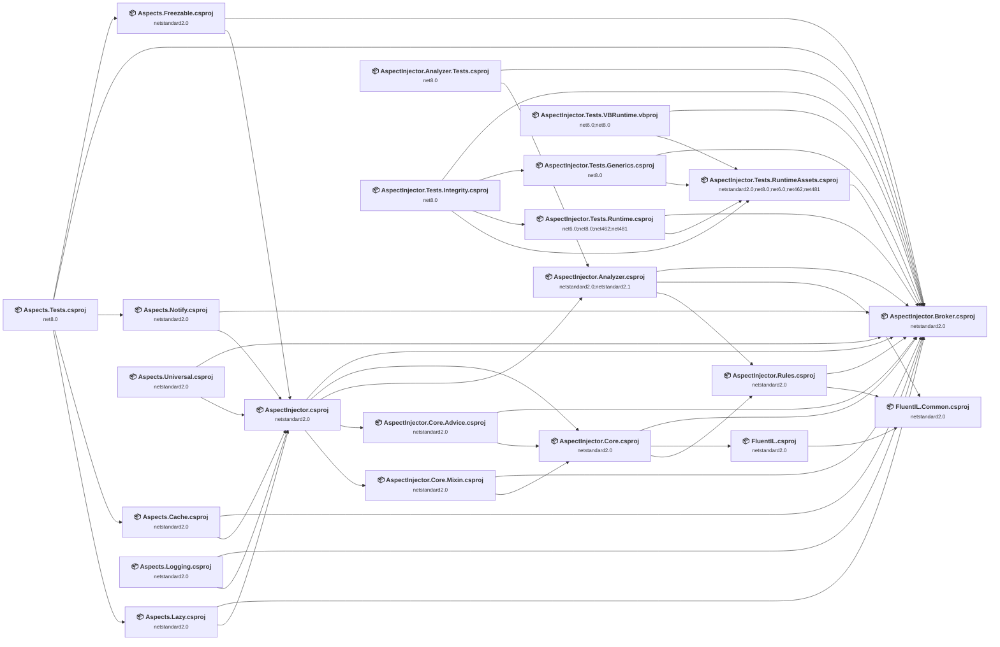
```mermaid
flowchart LR
    P1["<b>📦&nbsp;AspectInjector.Core.csproj</b><br/><small>netstandard2.0</small>"]
    P2["<b>📦&nbsp;AspectInjector.Core.Mixin.csproj</b><br/><small>netstandard2.0</small>"]
    P3["<b>📦&nbsp;AspectInjector.Core.Advice.csproj</b><br/><small>netstandard2.0</small>"]
    P4["<b>📦&nbsp;AspectInjector.Broker.csproj</b><br/><small>netstandard2.0</small>"]
    P5["<b>📦&nbsp;AspectInjector.Tests.RuntimeAssets.csproj</b><br/><small>netstandard2.0;net8.0;net6.0;net462;net481</small>"]
    P6["<b>📦&nbsp;AspectInjector.csproj</b><br/><small>netstandard2.0</small>"]
    P7["<b>📦&nbsp;AspectInjector.Tests.Runtime.csproj</b><br/><small>net6.0;net8.0;net462;net481</small>"]
    P8["<b>📦&nbsp;AspectInjector.Analyzer.csproj</b><br/><small>netstandard2.0;netstandard2.1</small>"]
    P9["<b>📦&nbsp;AspectInjector.Analyzer.Tests.csproj</b><br/><small>net8.0</small>"]
    P10["<b>📦&nbsp;AspectInjector.Rules.csproj</b><br/><small>netstandard2.0</small>"]
    P11["<b>📦&nbsp;FluentIL.csproj</b><br/><small>netstandard2.0</small>"]
    P12["<b>📦&nbsp;FluentIL.Common.csproj</b><br/><small>netstandard2.0</small>"]
    P13["<b>📦&nbsp;AspectInjector.Tests.Integrity.csproj</b><br/><small>net8.0</small>"]
    P14["<b>📦&nbsp;AspectInjector.Tests.Generics.csproj</b><br/><small>net8.0</small>"]
    P15["<b>📦&nbsp;AspectInjector.Tests.VBRuntime.vbproj</b><br/><small>net6.0;net8.0</small>"]
    P16["<b>📦&nbsp;Aspects.Tests.csproj</b><br/><small>net8.0</small>"]
    P17["<b>📦&nbsp;Aspects.Lazy.csproj</b><br/><small>netstandard2.0</small>"]
    P18["<b>📦&nbsp;Aspects.Freezable.csproj</b><br/><small>netstandard2.0</small>"]
    P19["<b>📦&nbsp;Aspects.Cache.csproj</b><br/><small>netstandard2.0</small>"]
    P20["<b>📦&nbsp;Aspects.Universal.csproj</b><br/><small>netstandard2.0</small>"]
    P21["<b>📦&nbsp;Aspects.Notify.csproj</b><br/><small>netstandard2.0</small>"]
    P22["<b>📦&nbsp;Aspects.Logging.csproj</b><br/><small>netstandard2.0</small>"]
    P1 --> P10
    P1 --> P11
    P1 --> P4
    P2 --> P1
    P2 --> P4
    P3 --> P1
    P3 --> P4
    P5 --> P4
    P6 --> P2
    P6 --> P3
    P6 --> P8
    P6 --> P1
    P6 --> P4
    P7 --> P5
    P7 --> P4
    P8 --> P10
    P8 --> P12
    P8 --> P4
    P9 --> P8
    P9 --> P4
    P10 --> P12
    P10 --> P4
    P11 --> P12
    P13 --> P5
    P13 --> P7
    P13 --> P14
    P13 --> P4
    P14 --> P5
    P14 --> P4
    P15 --> P5
    P15 --> P4
    P16 --> P17
    P16 --> P19
    P16 --> P21
    P16 --> P4
    P16 --> P18
    P17 --> P6
    P17 --> P4
    P18 --> P6
    P18 --> P4
    P19 --> P6
    P19 --> P4
    P20 --> P6
    P20 --> P4
    P21 --> P6
    P21 --> P4
    P22 --> P6
    P22 --> P4
    click P1 "#srcaspectinjectorcoreaspectinjectorcorecsproj"
    click P2 "#srcaspectinjectorcoremixinaspectinjectorcoremixincsproj"
    click P3 "#srcaspectinjectorcoreadviceaspectinjectorcoreadvicecsproj"
    click P4 "#srcaspectinjectorbrokeraspectinjectorbrokercsproj"
    click P5 "#testsaspectinjectortestsruntimeassetsaspectinjectortestsruntimeassetscsproj"
    click P6 "#srcaspectinjectoraspectinjectorcsproj"
    click P7 "#testsaspectinjectortestsruntimeaspectinjectortestsruntimecsproj"
    click P8 "#srcaspectinjectoranalyzeraspectinjectoranalyzercsproj"
    click P9 "#testsaspectinjectoranalyzertestsaspectinjectoranalyzertestscsproj"
    click P10 "#srcaspectinjectorrulesaspectinjectorrulescsproj"
    click P11 "#srcfluentilfluentilcsproj"
    click P12 "#srcfluentilcommonfluentilcommoncsproj"
    click P13 "#testsaspectinjectortestsintegrityaspectinjectortestsintegritycsproj"
    click P14 "#testsaspectinjectortestsgenericsaspectinjectortestsgenericscsproj"
    click P15 "#testsaspectinjectortestsvbruntimeaspectinjectortestsvbruntimevbproj"
    click P16 "#testsaspectstestsaspectstestscsproj"
    click P17 "#aspectslazyaspectslazycsproj"
    click P18 "#aspectsfreezableaspectsfreezablecsproj"
    click P19 "#aspectscacheaspectscachecsproj"
    click P20 "#aspectsuniversalaspectsuniversalcsproj"
    click P21 "#aspectsnotifyaspectsnotifycsproj"
    click P22 "#aspectsloggingaspectsloggingcsproj"

```

## Project Details

### aspects\Cache\Aspects.Cache.csproj

#### Project Info

- **Current Target Framework:** netstandard2.0✅
- **SDK-style**: True
- **Project Kind:** ClassLibrary
- **Dependencies**: 2
- **Dependants**: 1
- **Number of Files**: 5
- **Number of Files with Incidents**: 1
- **Lines of Code**: 317
- **Estimated LOC to modify**: 1+ (at least 0.3% of the project)

#### Dependency Graph

Legend:
📦 SDK-style project
⚙️ Classic project

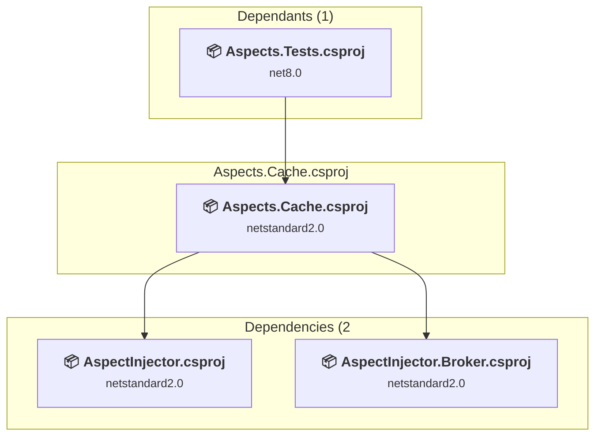
```mermaid
flowchart TB
    subgraph upstream["Dependants (1)"]
        P16["<b>📦&nbsp;Aspects.Tests.csproj</b><br/><small>net8.0</small>"]
        click P16 "#testsaspectstestsaspectstestscsproj"
    end
    subgraph current["Aspects.Cache.csproj"]
        MAIN["<b>📦&nbsp;Aspects.Cache.csproj</b><br/><small>netstandard2.0</small>"]
        click MAIN "#aspectscacheaspectscachecsproj"
    end
    subgraph downstream["Dependencies (2"]
        P6["<b>📦&nbsp;AspectInjector.csproj</b><br/><small>netstandard2.0</small>"]
        P4["<b>📦&nbsp;AspectInjector.Broker.csproj</b><br/><small>netstandard2.0</small>"]
        click P6 "#srcaspectinjectoraspectinjectorcsproj"
        click P4 "#srcaspectinjectorbrokeraspectinjectorbrokercsproj"
    end
    P16 --> MAIN
    MAIN --> P6
    MAIN --> P4

```

### API Compatibility

| Category | Count | Impact |
| :--- | :---: | :--- |
| 🔴 Binary Incompatible | 0 | High - Require code changes |
| 🟡 Source Incompatible | 0 | Medium - Needs re-compilation and potential conflicting API error fixing |
| 🔵 Behavioral change | 1 | Low - Behavioral changes that may require testing at runtime |
| ✅ Compatible | 189 |  |
| ***Total APIs Analyzed*** | ***190*** |  |

### aspects\Freezable\Aspects.Freezable.csproj

#### Project Info

- **Current Target Framework:** netstandard2.0✅
- **SDK-style**: True
- **Project Kind:** ClassLibrary
- **Dependencies**: 2
- **Dependants**: 1
- **Number of Files**: 3
- **Lines of Code**: 165
- **Estimated LOC to modify**: 0+ (at least 0.0% of the project)

#### Dependency Graph

Legend:
📦 SDK-style project
⚙️ Classic project

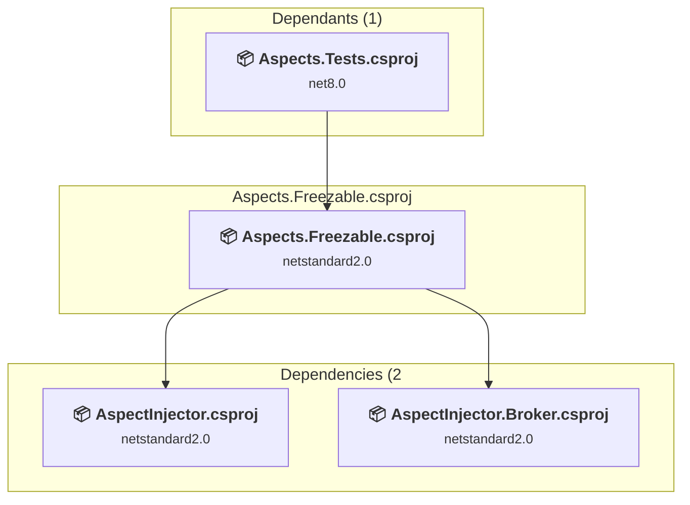
```mermaid
flowchart TB
    subgraph upstream["Dependants (1)"]
        P16["<b>📦&nbsp;Aspects.Tests.csproj</b><br/><small>net8.0</small>"]
        click P16 "#testsaspectstestsaspectstestscsproj"
    end
    subgraph current["Aspects.Freezable.csproj"]
        MAIN["<b>📦&nbsp;Aspects.Freezable.csproj</b><br/><small>netstandard2.0</small>"]
        click MAIN "#aspectsfreezableaspectsfreezablecsproj"
    end
    subgraph downstream["Dependencies (2"]
        P6["<b>📦&nbsp;AspectInjector.csproj</b><br/><small>netstandard2.0</small>"]
        P4["<b>📦&nbsp;AspectInjector.Broker.csproj</b><br/><small>netstandard2.0</small>"]
        click P6 "#srcaspectinjectoraspectinjectorcsproj"
        click P4 "#srcaspectinjectorbrokeraspectinjectorbrokercsproj"
    end
    P16 --> MAIN
    MAIN --> P6
    MAIN --> P4

```

### API Compatibility

| Category | Count | Impact |
| :--- | :---: | :--- |
| 🔴 Binary Incompatible | 0 | High - Require code changes |
| 🟡 Source Incompatible | 0 | Medium - Needs re-compilation and potential conflicting API error fixing |
| 🔵 Behavioral change | 0 | Low - Behavioral changes that may require testing at runtime |
| ✅ Compatible | 42 |  |
| ***Total APIs Analyzed*** | ***42*** |  |

### aspects\Lazy\Aspects.Lazy.csproj

#### Project Info

- **Current Target Framework:** netstandard2.0✅
- **SDK-style**: True
- **Project Kind:** ClassLibrary
- **Dependencies**: 2
- **Dependants**: 1
- **Number of Files**: 4
- **Lines of Code**: 177
- **Estimated LOC to modify**: 0+ (at least 0.0% of the project)

#### Dependency Graph

Legend:
📦 SDK-style project
⚙️ Classic project

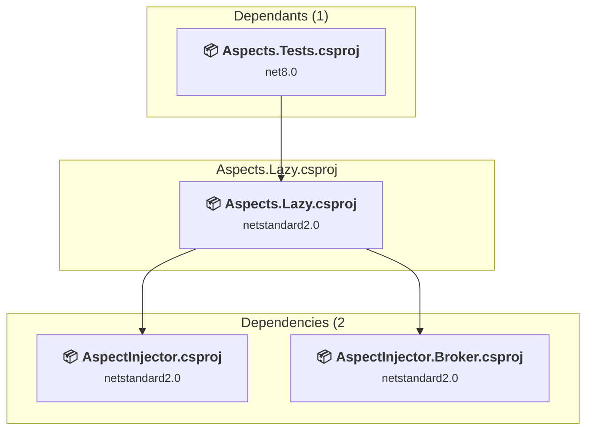
```mermaid
flowchart TB
    subgraph upstream["Dependants (1)"]
        P16["<b>📦&nbsp;Aspects.Tests.csproj</b><br/><small>net8.0</small>"]
        click P16 "#testsaspectstestsaspectstestscsproj"
    end
    subgraph current["Aspects.Lazy.csproj"]
        MAIN["<b>📦&nbsp;Aspects.Lazy.csproj</b><br/><small>netstandard2.0</small>"]
        click MAIN "#aspectslazyaspectslazycsproj"
    end
    subgraph downstream["Dependencies (2"]
        P6["<b>📦&nbsp;AspectInjector.csproj</b><br/><small>netstandard2.0</small>"]
        P4["<b>📦&nbsp;AspectInjector.Broker.csproj</b><br/><small>netstandard2.0</small>"]
        click P6 "#srcaspectinjectoraspectinjectorcsproj"
        click P4 "#srcaspectinjectorbrokeraspectinjectorbrokercsproj"
    end
    P16 --> MAIN
    MAIN --> P6
    MAIN --> P4

```

### API Compatibility

| Category | Count | Impact |
| :--- | :---: | :--- |
| 🔴 Binary Incompatible | 0 | High - Require code changes |
| 🟡 Source Incompatible | 0 | Medium - Needs re-compilation and potential conflicting API error fixing |
| 🔵 Behavioral change | 0 | Low - Behavioral changes that may require testing at runtime |
| ✅ Compatible | 49 |  |
| ***Total APIs Analyzed*** | ***49*** |  |

### aspects\Logging\Aspects.Logging.csproj

#### Project Info

- **Current Target Framework:** netstandard2.0✅
- **SDK-style**: True
- **Project Kind:** ClassLibrary
- **Dependencies**: 2
- **Dependants**: 0
- **Number of Files**: 4
- **Number of Files with Incidents**: 1
- **Lines of Code**: 195
- **Estimated LOC to modify**: 2+ (at least 1.0% of the project)

#### Dependency Graph

Legend:
📦 SDK-style project
⚙️ Classic project

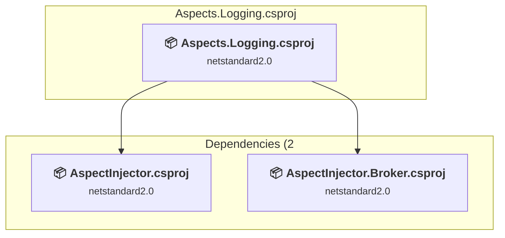
```mermaid
flowchart TB
    subgraph current["Aspects.Logging.csproj"]
        MAIN["<b>📦&nbsp;Aspects.Logging.csproj</b><br/><small>netstandard2.0</small>"]
        click MAIN "#aspectsloggingaspectsloggingcsproj"
    end
    subgraph downstream["Dependencies (2"]
        P6["<b>📦&nbsp;AspectInjector.csproj</b><br/><small>netstandard2.0</small>"]
        P4["<b>📦&nbsp;AspectInjector.Broker.csproj</b><br/><small>netstandard2.0</small>"]
        click P6 "#srcaspectinjectoraspectinjectorcsproj"
        click P4 "#srcaspectinjectorbrokeraspectinjectorbrokercsproj"
    end
    MAIN --> P6
    MAIN --> P4

```

### API Compatibility

| Category | Count | Impact |
| :--- | :---: | :--- |
| 🔴 Binary Incompatible | 0 | High - Require code changes |
| 🟡 Source Incompatible | 0 | Medium - Needs re-compilation and potential conflicting API error fixing |
| 🔵 Behavioral change | 2 | Low - Behavioral changes that may require testing at runtime |
| ✅ Compatible | 77 |  |
| ***Total APIs Analyzed*** | ***79*** |  |

### aspects\Notify\Aspects.Notify.csproj

#### Project Info

- **Current Target Framework:** netstandard2.0✅
- **SDK-style**: True
- **Project Kind:** ClassLibrary
- **Dependencies**: 2
- **Dependants**: 1
- **Number of Files**: 3
- **Lines of Code**: 171
- **Estimated LOC to modify**: 0+ (at least 0.0% of the project)

#### Dependency Graph

Legend:
📦 SDK-style project
⚙️ Classic project

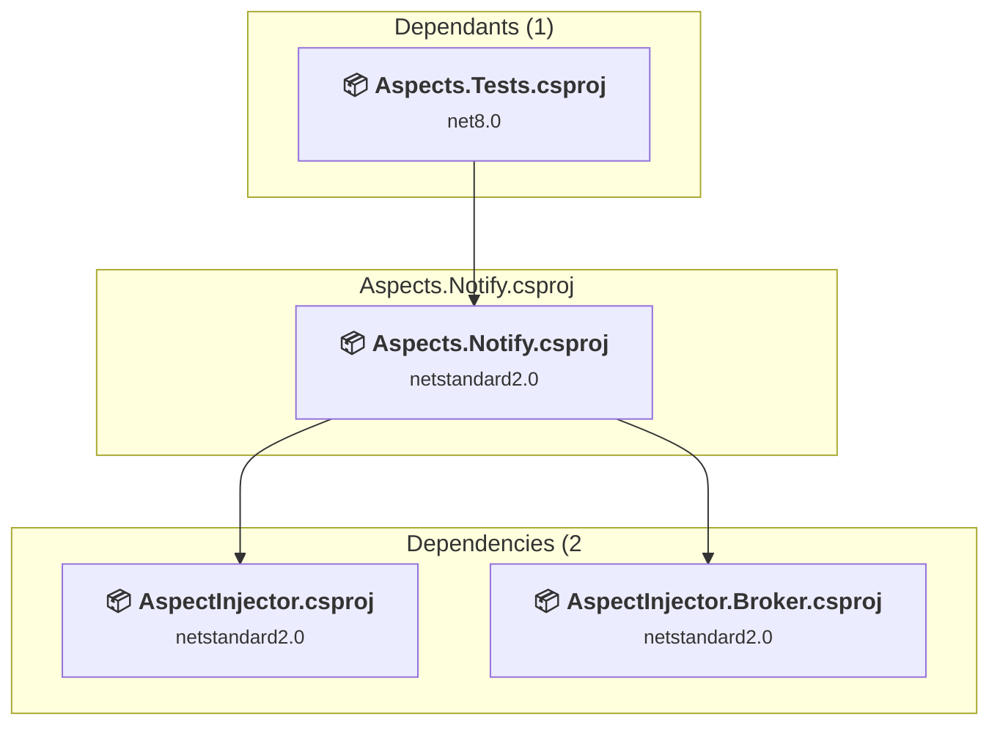
```mermaid
flowchart TB
    subgraph upstream["Dependants (1)"]
        P16["<b>📦&nbsp;Aspects.Tests.csproj</b><br/><small>net8.0</small>"]
        click P16 "#testsaspectstestsaspectstestscsproj"
    end
    subgraph current["Aspects.Notify.csproj"]
        MAIN["<b>📦&nbsp;Aspects.Notify.csproj</b><br/><small>netstandard2.0</small>"]
        click MAIN "#aspectsnotifyaspectsnotifycsproj"
    end
    subgraph downstream["Dependencies (2"]
        P6["<b>📦&nbsp;AspectInjector.csproj</b><br/><small>netstandard2.0</small>"]
        P4["<b>📦&nbsp;AspectInjector.Broker.csproj</b><br/><small>netstandard2.0</small>"]
        click P6 "#srcaspectinjectoraspectinjectorcsproj"
        click P4 "#srcaspectinjectorbrokeraspectinjectorbrokercsproj"
    end
    P16 --> MAIN
    MAIN --> P6
    MAIN --> P4

```

### API Compatibility

| Category | Count | Impact |
| :--- | :---: | :--- |
| 🔴 Binary Incompatible | 0 | High - Require code changes |
| 🟡 Source Incompatible | 0 | Medium - Needs re-compilation and potential conflicting API error fixing |
| 🔵 Behavioral change | 0 | Low - Behavioral changes that may require testing at runtime |
| ✅ Compatible | 56 |  |
| ***Total APIs Analyzed*** | ***56*** |  |

### aspects\Universal\Aspects.Universal.csproj

#### Project Info

- **Current Target Framework:** netstandard2.0✅
- **SDK-style**: True
- **Project Kind:** ClassLibrary
- **Dependencies**: 2
- **Dependants**: 0
- **Number of Files**: 14
- **Lines of Code**: 480
- **Estimated LOC to modify**: 0+ (at least 0.0% of the project)

#### Dependency Graph

Legend:
📦 SDK-style project
⚙️ Classic project

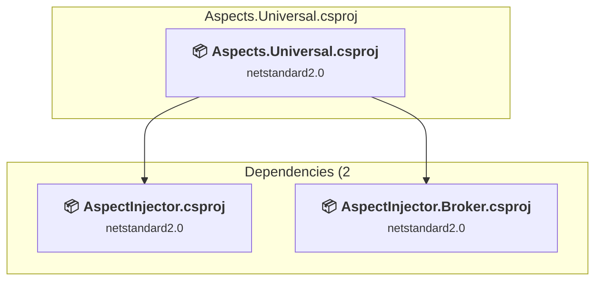
```mermaid
flowchart TB
    subgraph current["Aspects.Universal.csproj"]
        MAIN["<b>📦&nbsp;Aspects.Universal.csproj</b><br/><small>netstandard2.0</small>"]
        click MAIN "#aspectsuniversalaspectsuniversalcsproj"
    end
    subgraph downstream["Dependencies (2"]
        P6["<b>📦&nbsp;AspectInjector.csproj</b><br/><small>netstandard2.0</small>"]
        P4["<b>📦&nbsp;AspectInjector.Broker.csproj</b><br/><small>netstandard2.0</small>"]
        click P6 "#srcaspectinjectoraspectinjectorcsproj"
        click P4 "#srcaspectinjectorbrokeraspectinjectorbrokercsproj"
    end
    MAIN --> P6
    MAIN --> P4

```

### API Compatibility

| Category | Count | Impact |
| :--- | :---: | :--- |
| 🔴 Binary Incompatible | 0 | High - Require code changes |
| 🟡 Source Incompatible | 0 | Medium - Needs re-compilation and potential conflicting API error fixing |
| 🔵 Behavioral change | 0 | Low - Behavioral changes that may require testing at runtime |
| ✅ Compatible | 211 |  |
| ***Total APIs Analyzed*** | ***211*** |  |

### src\AspectInjector.Analyzer\AspectInjector.Analyzer.csproj

#### Project Info

- **Current Target Framework:** netstandard2.0;netstandard2.1
- **Proposed Target Framework:** netstandard2.0;netstandard2.1;net10.0
- **SDK-style**: True
- **Project Kind:** ClassLibrary
- **Dependencies**: 3
- **Dependants**: 2
- **Number of Files**: 20
- **Number of Files with Incidents**: 3
- **Lines of Code**: 1286
- **Estimated LOC to modify**: 4+ (at least 0.3% of the project)

#### Dependency Graph

Legend:
📦 SDK-style project
⚙️ Classic project

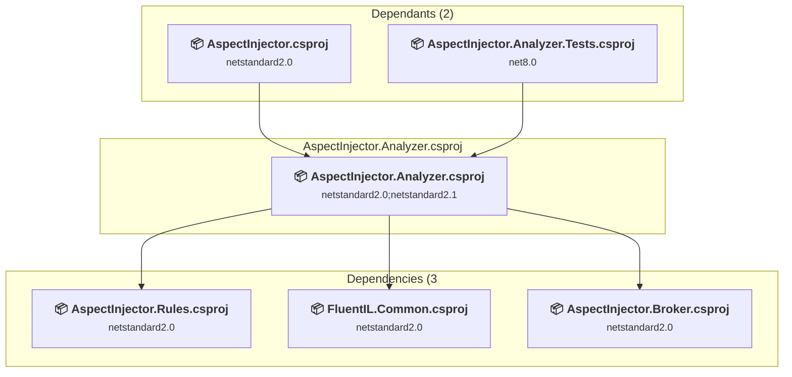
```mermaid
flowchart TB
    subgraph upstream["Dependants (2)"]
        P6["<b>📦&nbsp;AspectInjector.csproj</b><br/><small>netstandard2.0</small>"]
        P9["<b>📦&nbsp;AspectInjector.Analyzer.Tests.csproj</b><br/><small>net8.0</small>"]
        click P6 "#srcaspectinjectoraspectinjectorcsproj"
        click P9 "#testsaspectinjectoranalyzertestsaspectinjectoranalyzertestscsproj"
    end
    subgraph current["AspectInjector.Analyzer.csproj"]
        MAIN["<b>📦&nbsp;AspectInjector.Analyzer.csproj</b><br/><small>netstandard2.0;netstandard2.1</small>"]
        click MAIN "#srcaspectinjectoranalyzeraspectinjectoranalyzercsproj"
    end
    subgraph downstream["Dependencies (3"]
        P10["<b>📦&nbsp;AspectInjector.Rules.csproj</b><br/><small>netstandard2.0</small>"]
        P12["<b>📦&nbsp;FluentIL.Common.csproj</b><br/><small>netstandard2.0</small>"]
        P4["<b>📦&nbsp;AspectInjector.Broker.csproj</b><br/><small>netstandard2.0</small>"]
        click P10 "#srcaspectinjectorrulesaspectinjectorrulescsproj"
        click P12 "#srcfluentilcommonfluentilcommoncsproj"
        click P4 "#srcaspectinjectorbrokeraspectinjectorbrokercsproj"
    end
    P6 --> MAIN
    P9 --> MAIN
    MAIN --> P10
    MAIN --> P12
    MAIN --> P4

```

### API Compatibility

| Category | Count | Impact |
| :--- | :---: | :--- |
| 🔴 Binary Incompatible | 0 | High - Require code changes |
| 🟡 Source Incompatible | 4 | Medium - Needs re-compilation and potential conflicting API error fixing |
| 🔵 Behavioral change | 0 | Low - Behavioral changes that may require testing at runtime |
| ✅ Compatible | 1808 |  |
| ***Total APIs Analyzed*** | ***1812*** |  |

### src\AspectInjector.Broker\AspectInjector.Broker.csproj

#### Project Info

- **Current Target Framework:** netstandard2.0✅
- **SDK-style**: True
- **Project Kind:** ClassLibrary
- **Dependencies**: 0
- **Dependants**: 19
- **Number of Files**: 13
- **Lines of Code**: 578
- **Estimated LOC to modify**: 0+ (at least 0.0% of the project)

#### Dependency Graph

Legend:
📦 SDK-style project
⚙️ Classic project

```mermaid
flowchart TB
    subgraph upstream["Dependants (19)"]
        P1["<b>📦&nbsp;AspectInjector.Core.csproj</b><br/><small>netstandard2.0</small>"]
        P2["<b>📦&nbsp;AspectInjector.Core.Mixin.csproj</b><br/><small>netstandard2.0</small>"]
        P3["<b>📦&nbsp;AspectInjector.Core.Advice.csproj</b><br/><small>netstandard2.0</small>"]
        P5["<b>📦&nbsp;AspectInjector.Tests.RuntimeAssets.csproj</b><br/><small>netstandard2.0;net8.0;net6.0;net462;net481</small>"]
        P6["<b>📦&nbsp;AspectInjector.csproj</b><br/><small>netstandard2.0</small>"]
        P7["<b>📦&nbsp;AspectInjector.Tests.Runtime.csproj</b><br/><small>net6.0;net8.0;net462;net481</small>"]
        P8["<b>📦&nbsp;AspectInjector.Analyzer.csproj</b><br/><small>netstandard2.0;netstandard2.1</small>"]
        P9["<b>📦&nbsp;AspectInjector.Analyzer.Tests.csproj</b><br/><small>net8.0</small>"]
        P10["<b>📦&nbsp;AspectInjector.Rules.csproj</b><br/><small>netstandard2.0</small>"]
        P13["<b>📦&nbsp;AspectInjector.Tests.Integrity.csproj</b><br/><small>net8.0</small>"]
        P14["<b>📦&nbsp;AspectInjector.Tests.Generics.csproj</b><br/><small>net8.0</small>"]
        P15["<b>📦&nbsp;AspectInjector.Tests.VBRuntime.vbproj</b><br/><small>net6.0;net8.0</small>"]
        P16["<b>📦&nbsp;Aspects.Tests.csproj</b><br/><small>net8.0</small>"]
        P17["<b>📦&nbsp;Aspects.Lazy.csproj</b><br/><small>netstandard2.0</small>"]
        P18["<b>📦&nbsp;Aspects.Freezable.csproj</b><br/><small>netstandard2.0</small>"]
        P19["<b>📦&nbsp;Aspects.Cache.csproj</b><br/><small>netstandard2.0</small>"]
        P20["<b>📦&nbsp;Aspects.Universal.csproj</b><br/><small>netstandard2.0</small>"]
        P21["<b>📦&nbsp;Aspects.Notify.csproj</b><br/><small>netstandard2.0</small>"]
        P22["<b>📦&nbsp;Aspects.Logging.csproj</b><br/><small>netstandard2.0</small>"]
        click P1 "#srcaspectinjectorcoreaspectinjectorcorecsproj"
        click P2 "#srcaspectinjectorcoremixinaspectinjectorcoremixincsproj"
        click P3 "#srcaspectinjectorcoreadviceaspectinjectorcoreadvicecsproj"
        click P5 "#testsaspectinjectortestsruntimeassetsaspectinjectortestsruntimeassetscsproj"
        click P6 "#srcaspectinjectoraspectinjectorcsproj"
        click P7 "#testsaspectinjectortestsruntimeaspectinjectortestsruntimecsproj"
        click P8 "#srcaspectinjectoranalyzeraspectinjectoranalyzercsproj"
        click P9 "#testsaspectinjectoranalyzertestsaspectinjectoranalyzertestscsproj"
        click P10 "#srcaspectinjectorrulesaspectinjectorrulescsproj"
        click P13 "#testsaspectinjectortestsintegrityaspectinjectortestsintegritycsproj"
        click P14 "#testsaspectinjectortestsgenericsaspectinjectortestsgenericscsproj"
        click P15 "#testsaspectinjectortestsvbruntimeaspectinjectortestsvbruntimevbproj"
        click P16 "#testsaspectstestsaspectstestscsproj"
        click P17 "#aspectslazyaspectslazycsproj"
        click P18 "#aspectsfreezableaspectsfreezablecsproj"
        click P19 "#aspectscacheaspectscachecsproj"
        click P20 "#aspectsuniversalaspectsuniversalcsproj"
        click P21 "#aspectsnotifyaspectsnotifycsproj"
        click P22 "#aspectsloggingaspectsloggingcsproj"
    end
    subgraph current["AspectInjector.Broker.csproj"]
        MAIN["<b>📦&nbsp;AspectInjector.Broker.csproj</b><br/><small>netstandard2.0</small>"]
        click MAIN "#srcaspectinjectorbrokeraspectinjectorbrokercsproj"
    end
    P1 --> MAIN
    P2 --> MAIN
    P3 --> MAIN
    P5 --> MAIN
    P6 --> MAIN
    P7 --> MAIN
    P8 --> MAIN
    P9 --> MAIN
    P10 --> MAIN
    P13 --> MAIN
    P14 --> MAIN
    P15 --> MAIN
    P16 --> MAIN
    P17 --> MAIN
    P18 --> MAIN
    P19 --> MAIN
    P20 --> MAIN
    P21 --> MAIN
    P22 --> MAIN

```

### API Compatibility

| Category | Count | Impact |
| :--- | :---: | :--- |
| 🔴 Binary Incompatible | 0 | High - Require code changes |
| 🟡 Source Incompatible | 0 | Medium - Needs re-compilation and potential conflicting API error fixing |
| 🔵 Behavioral change | 0 | Low - Behavioral changes that may require testing at runtime |
| ✅ Compatible | 108 |  |
| ***Total APIs Analyzed*** | ***108*** |  |

### src\AspectInjector.Core.Advice\AspectInjector.Core.Advice.csproj

#### Project Info

- **Current Target Framework:** netstandard2.0✅
- **SDK-style**: True
- **Project Kind:** ClassLibrary
- **Dependencies**: 2
- **Dependants**: 1
- **Number of Files**: 19
- **Lines of Code**: 1568
- **Estimated LOC to modify**: 0+ (at least 0.0% of the project)

#### Dependency Graph

Legend:
📦 SDK-style project
⚙️ Classic project

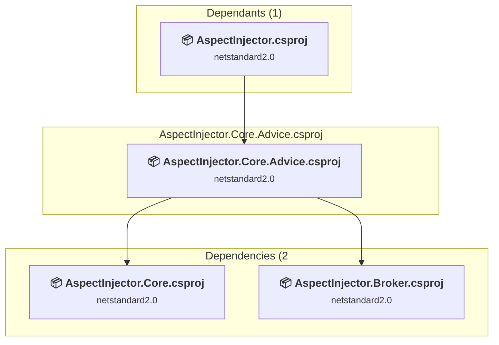
```mermaid
flowchart TB
    subgraph upstream["Dependants (1)"]
        P6["<b>📦&nbsp;AspectInjector.csproj</b><br/><small>netstandard2.0</small>"]
        click P6 "#srcaspectinjectoraspectinjectorcsproj"
    end
    subgraph current["AspectInjector.Core.Advice.csproj"]
        MAIN["<b>📦&nbsp;AspectInjector.Core.Advice.csproj</b><br/><small>netstandard2.0</small>"]
        click MAIN "#srcaspectinjectorcoreadviceaspectinjectorcoreadvicecsproj"
    end
    subgraph downstream["Dependencies (2"]
        P1["<b>📦&nbsp;AspectInjector.Core.csproj</b><br/><small>netstandard2.0</small>"]
        P4["<b>📦&nbsp;AspectInjector.Broker.csproj</b><br/><small>netstandard2.0</small>"]
        click P1 "#srcaspectinjectorcoreaspectinjectorcorecsproj"
        click P4 "#srcaspectinjectorbrokeraspectinjectorbrokercsproj"
    end
    P6 --> MAIN
    MAIN --> P1
    MAIN --> P4

```

### API Compatibility

| Category | Count | Impact |
| :--- | :---: | :--- |
| 🔴 Binary Incompatible | 0 | High - Require code changes |
| 🟡 Source Incompatible | 0 | Medium - Needs re-compilation and potential conflicting API error fixing |
| 🔵 Behavioral change | 0 | Low - Behavioral changes that may require testing at runtime |
| ✅ Compatible | 2620 |  |
| ***Total APIs Analyzed*** | ***2620*** |  |

### src\AspectInjector.Core.Mixin\AspectInjector.Core.Mixin.csproj

#### Project Info

- **Current Target Framework:** netstandard2.0✅
- **SDK-style**: True
- **Project Kind:** ClassLibrary
- **Dependencies**: 2
- **Dependants**: 1
- **Number of Files**: 6
- **Lines of Code**: 482
- **Estimated LOC to modify**: 0+ (at least 0.0% of the project)

#### Dependency Graph

Legend:
📦 SDK-style project
⚙️ Classic project

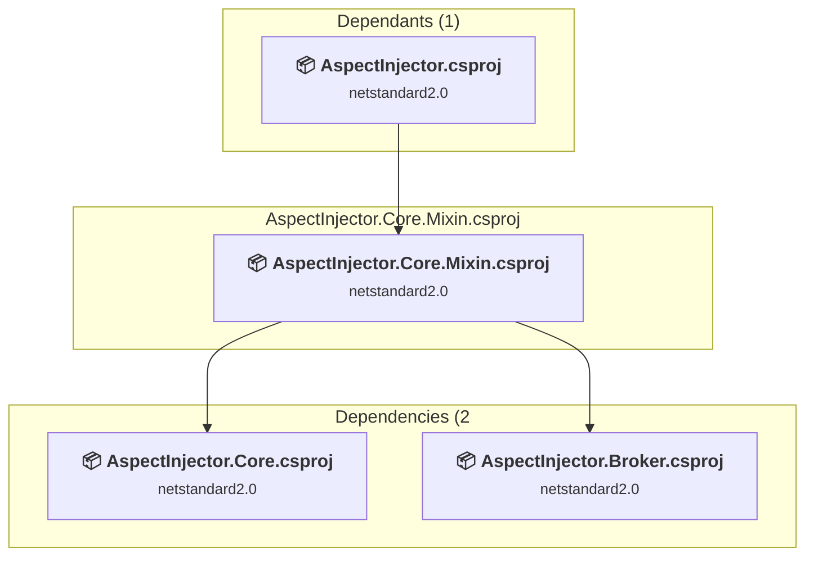
```mermaid
flowchart TB
    subgraph upstream["Dependants (1)"]
        P6["<b>📦&nbsp;AspectInjector.csproj</b><br/><small>netstandard2.0</small>"]
        click P6 "#srcaspectinjectoraspectinjectorcsproj"
    end
    subgraph current["AspectInjector.Core.Mixin.csproj"]
        MAIN["<b>📦&nbsp;AspectInjector.Core.Mixin.csproj</b><br/><small>netstandard2.0</small>"]
        click MAIN "#srcaspectinjectorcoremixinaspectinjectorcoremixincsproj"
    end
    subgraph downstream["Dependencies (2"]
        P1["<b>📦&nbsp;AspectInjector.Core.csproj</b><br/><small>netstandard2.0</small>"]
        P4["<b>📦&nbsp;AspectInjector.Broker.csproj</b><br/><small>netstandard2.0</small>"]
        click P1 "#srcaspectinjectorcoreaspectinjectorcorecsproj"
        click P4 "#srcaspectinjectorbrokeraspectinjectorbrokercsproj"
    end
    P6 --> MAIN
    MAIN --> P1
    MAIN --> P4

```

### API Compatibility

| Category | Count | Impact |
| :--- | :---: | :--- |
| 🔴 Binary Incompatible | 0 | High - Require code changes |
| 🟡 Source Incompatible | 0 | Medium - Needs re-compilation and potential conflicting API error fixing |
| 🔵 Behavioral change | 0 | Low - Behavioral changes that may require testing at runtime |
| ✅ Compatible | 600 |  |
| ***Total APIs Analyzed*** | ***600*** |  |

### src\AspectInjector.Core\AspectInjector.Core.csproj

#### Project Info

- **Current Target Framework:** netstandard2.0✅
- **SDK-style**: True
- **Project Kind:** ClassLibrary
- **Dependencies**: 3
- **Dependants**: 3
- **Number of Files**: 19
- **Lines of Code**: 1121
- **Estimated LOC to modify**: 0+ (at least 0.0% of the project)

#### Dependency Graph

Legend:
📦 SDK-style project
⚙️ Classic project

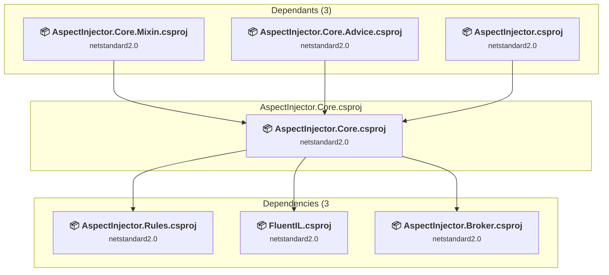
```mermaid
flowchart TB
    subgraph upstream["Dependants (3)"]
        P2["<b>📦&nbsp;AspectInjector.Core.Mixin.csproj</b><br/><small>netstandard2.0</small>"]
        P3["<b>📦&nbsp;AspectInjector.Core.Advice.csproj</b><br/><small>netstandard2.0</small>"]
        P6["<b>📦&nbsp;AspectInjector.csproj</b><br/><small>netstandard2.0</small>"]
        click P2 "#srcaspectinjectorcoremixinaspectinjectorcoremixincsproj"
        click P3 "#srcaspectinjectorcoreadviceaspectinjectorcoreadvicecsproj"
        click P6 "#srcaspectinjectoraspectinjectorcsproj"
    end
    subgraph current["AspectInjector.Core.csproj"]
        MAIN["<b>📦&nbsp;AspectInjector.Core.csproj</b><br/><small>netstandard2.0</small>"]
        click MAIN "#srcaspectinjectorcoreaspectinjectorcorecsproj"
    end
    subgraph downstream["Dependencies (3"]
        P10["<b>📦&nbsp;AspectInjector.Rules.csproj</b><br/><small>netstandard2.0</small>"]
        P11["<b>📦&nbsp;FluentIL.csproj</b><br/><small>netstandard2.0</small>"]
        P4["<b>📦&nbsp;AspectInjector.Broker.csproj</b><br/><small>netstandard2.0</small>"]
        click P10 "#srcaspectinjectorrulesaspectinjectorrulescsproj"
        click P11 "#srcfluentilfluentilcsproj"
        click P4 "#srcaspectinjectorbrokeraspectinjectorbrokercsproj"
    end
    P2 --> MAIN
    P3 --> MAIN
    P6 --> MAIN
    MAIN --> P10
    MAIN --> P11
    MAIN --> P4

```

### API Compatibility

| Category | Count | Impact |
| :--- | :---: | :--- |
| 🔴 Binary Incompatible | 0 | High - Require code changes |
| 🟡 Source Incompatible | 0 | Medium - Needs re-compilation and potential conflicting API error fixing |
| 🔵 Behavioral change | 0 | Low - Behavioral changes that may require testing at runtime |
| ✅ Compatible | 1250 |  |
| ***Total APIs Analyzed*** | ***1250*** |  |

### src\AspectInjector.Rules\AspectInjector.Rules.csproj

#### Project Info

- **Current Target Framework:** netstandard2.0✅
- **SDK-style**: True
- **Project Kind:** ClassLibrary
- **Dependencies**: 2
- **Dependants**: 2
- **Number of Files**: 6
- **Lines of Code**: 315
- **Estimated LOC to modify**: 0+ (at least 0.0% of the project)

#### Dependency Graph

Legend:
📦 SDK-style project
⚙️ Classic project

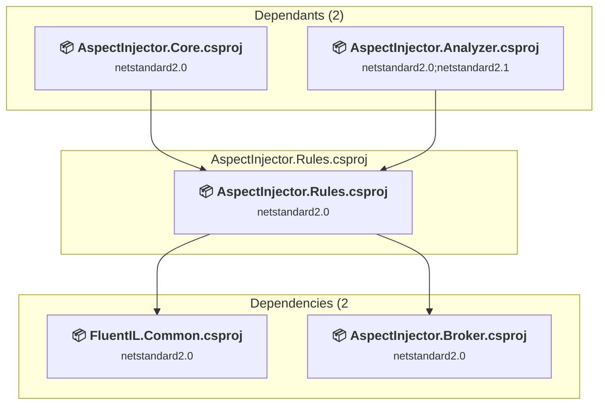
```mermaid
flowchart TB
    subgraph upstream["Dependants (2)"]
        P1["<b>📦&nbsp;AspectInjector.Core.csproj</b><br/><small>netstandard2.0</small>"]
        P8["<b>📦&nbsp;AspectInjector.Analyzer.csproj</b><br/><small>netstandard2.0;netstandard2.1</small>"]
        click P1 "#srcaspectinjectorcoreaspectinjectorcorecsproj"
        click P8 "#srcaspectinjectoranalyzeraspectinjectoranalyzercsproj"
    end
    subgraph current["AspectInjector.Rules.csproj"]
        MAIN["<b>📦&nbsp;AspectInjector.Rules.csproj</b><br/><small>netstandard2.0</small>"]
        click MAIN "#srcaspectinjectorrulesaspectinjectorrulescsproj"
    end
    subgraph downstream["Dependencies (2"]
        P12["<b>📦&nbsp;FluentIL.Common.csproj</b><br/><small>netstandard2.0</small>"]
        P4["<b>📦&nbsp;AspectInjector.Broker.csproj</b><br/><small>netstandard2.0</small>"]
        click P12 "#srcfluentilcommonfluentilcommoncsproj"
        click P4 "#srcaspectinjectorbrokeraspectinjectorbrokercsproj"
    end
    P1 --> MAIN
    P8 --> MAIN
    MAIN --> P12
    MAIN --> P4

```

### API Compatibility

| Category | Count | Impact |
| :--- | :---: | :--- |
| 🔴 Binary Incompatible | 0 | High - Require code changes |
| 🟡 Source Incompatible | 0 | Medium - Needs re-compilation and potential conflicting API error fixing |
| 🔵 Behavioral change | 0 | Low - Behavioral changes that may require testing at runtime |
| ✅ Compatible | 21 |  |
| ***Total APIs Analyzed*** | ***21*** |  |

### src\AspectInjector\AspectInjector.csproj

#### Project Info

- **Current Target Framework:** netstandard2.0✅
- **SDK-style**: True
- **Project Kind:** ClassLibrary
- **Dependencies**: 5
- **Dependants**: 6
- **Number of Files**: 5
- **Lines of Code**: 294
- **Estimated LOC to modify**: 0+ (at least 0.0% of the project)

#### Dependency Graph

Legend:
📦 SDK-style project
⚙️ Classic project

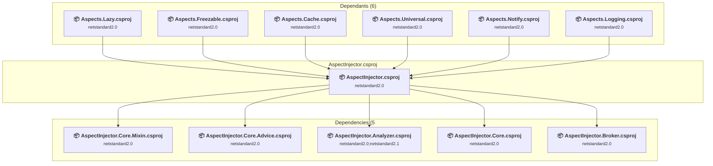
```mermaid
flowchart TB
    subgraph upstream["Dependants (6)"]
        P17["<b>📦&nbsp;Aspects.Lazy.csproj</b><br/><small>netstandard2.0</small>"]
        P18["<b>📦&nbsp;Aspects.Freezable.csproj</b><br/><small>netstandard2.0</small>"]
        P19["<b>📦&nbsp;Aspects.Cache.csproj</b><br/><small>netstandard2.0</small>"]
        P20["<b>📦&nbsp;Aspects.Universal.csproj</b><br/><small>netstandard2.0</small>"]
        P21["<b>📦&nbsp;Aspects.Notify.csproj</b><br/><small>netstandard2.0</small>"]
        P22["<b>📦&nbsp;Aspects.Logging.csproj</b><br/><small>netstandard2.0</small>"]
        click P17 "#aspectslazyaspectslazycsproj"
        click P18 "#aspectsfreezableaspectsfreezablecsproj"
        click P19 "#aspectscacheaspectscachecsproj"
        click P20 "#aspectsuniversalaspectsuniversalcsproj"
        click P21 "#aspectsnotifyaspectsnotifycsproj"
        click P22 "#aspectsloggingaspectsloggingcsproj"
    end
    subgraph current["AspectInjector.csproj"]
        MAIN["<b>📦&nbsp;AspectInjector.csproj</b><br/><small>netstandard2.0</small>"]
        click MAIN "#srcaspectinjectoraspectinjectorcsproj"
    end
    subgraph downstream["Dependencies (5"]
        P2["<b>📦&nbsp;AspectInjector.Core.Mixin.csproj</b><br/><small>netstandard2.0</small>"]
        P3["<b>📦&nbsp;AspectInjector.Core.Advice.csproj</b><br/><small>netstandard2.0</small>"]
        P8["<b>📦&nbsp;AspectInjector.Analyzer.csproj</b><br/><small>netstandard2.0;netstandard2.1</small>"]
        P1["<b>📦&nbsp;AspectInjector.Core.csproj</b><br/><small>netstandard2.0</small>"]
        P4["<b>📦&nbsp;AspectInjector.Broker.csproj</b><br/><small>netstandard2.0</small>"]
        click P2 "#srcaspectinjectorcoremixinaspectinjectorcoremixincsproj"
        click P3 "#srcaspectinjectorcoreadviceaspectinjectorcoreadvicecsproj"
        click P8 "#srcaspectinjectoranalyzeraspectinjectoranalyzercsproj"
        click P1 "#srcaspectinjectorcoreaspectinjectorcorecsproj"
        click P4 "#srcaspectinjectorbrokeraspectinjectorbrokercsproj"
    end
    P17 --> MAIN
    P18 --> MAIN
    P19 --> MAIN
    P20 --> MAIN
    P21 --> MAIN
    P22 --> MAIN
    MAIN --> P2
    MAIN --> P3
    MAIN --> P8
    MAIN --> P1
    MAIN --> P4

```

### API Compatibility

| Category | Count | Impact |
| :--- | :---: | :--- |
| 🔴 Binary Incompatible | 0 | High - Require code changes |
| 🟡 Source Incompatible | 0 | Medium - Needs re-compilation and potential conflicting API error fixing |
| 🔵 Behavioral change | 0 | Low - Behavioral changes that may require testing at runtime |
| ✅ Compatible | 243 |  |
| ***Total APIs Analyzed*** | ***243*** |  |

### src\FluentIL.Common\FluentIL.Common.csproj

#### Project Info

- **Current Target Framework:** netstandard2.0✅
- **SDK-style**: True
- **Project Kind:** ClassLibrary
- **Dependencies**: 0
- **Dependants**: 3
- **Number of Files**: 3
- **Lines of Code**: 158
- **Estimated LOC to modify**: 0+ (at least 0.0% of the project)

#### Dependency Graph

Legend:
📦 SDK-style project
⚙️ Classic project

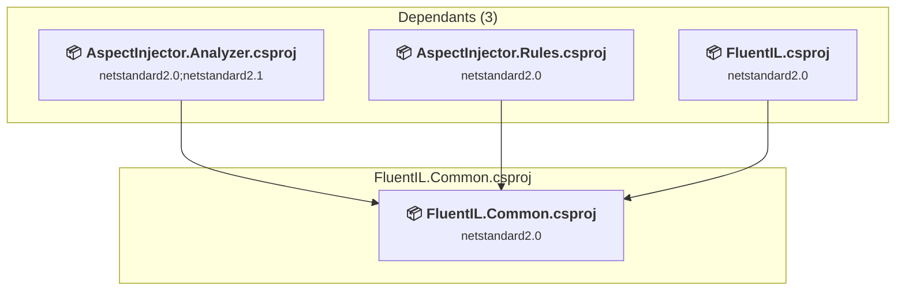
```mermaid
flowchart TB
    subgraph upstream["Dependants (3)"]
        P8["<b>📦&nbsp;AspectInjector.Analyzer.csproj</b><br/><small>netstandard2.0;netstandard2.1</small>"]
        P10["<b>📦&nbsp;AspectInjector.Rules.csproj</b><br/><small>netstandard2.0</small>"]
        P11["<b>📦&nbsp;FluentIL.csproj</b><br/><small>netstandard2.0</small>"]
        click P8 "#srcaspectinjectoranalyzeraspectinjectoranalyzercsproj"
        click P10 "#srcaspectinjectorrulesaspectinjectorrulescsproj"
        click P11 "#srcfluentilfluentilcsproj"
    end
    subgraph current["FluentIL.Common.csproj"]
        MAIN["<b>📦&nbsp;FluentIL.Common.csproj</b><br/><small>netstandard2.0</small>"]
        click MAIN "#srcfluentilcommonfluentilcommoncsproj"
    end
    P8 --> MAIN
    P10 --> MAIN
    P11 --> MAIN

```

### API Compatibility

| Category | Count | Impact |
| :--- | :---: | :--- |
| 🔴 Binary Incompatible | 0 | High - Require code changes |
| 🟡 Source Incompatible | 0 | Medium - Needs re-compilation and potential conflicting API error fixing |
| 🔵 Behavioral change | 0 | Low - Behavioral changes that may require testing at runtime |
| ✅ Compatible | 53 |  |
| ***Total APIs Analyzed*** | ***53*** |  |

### src\FluentIL\FluentIL.csproj

#### Project Info

- **Current Target Framework:** netstandard2.0✅
- **SDK-style**: True
- **Project Kind:** ClassLibrary
- **Dependencies**: 1
- **Dependants**: 1
- **Number of Files**: 20
- **Lines of Code**: 1677
- **Estimated LOC to modify**: 0+ (at least 0.0% of the project)

#### Dependency Graph

Legend:
📦 SDK-style project
⚙️ Classic project

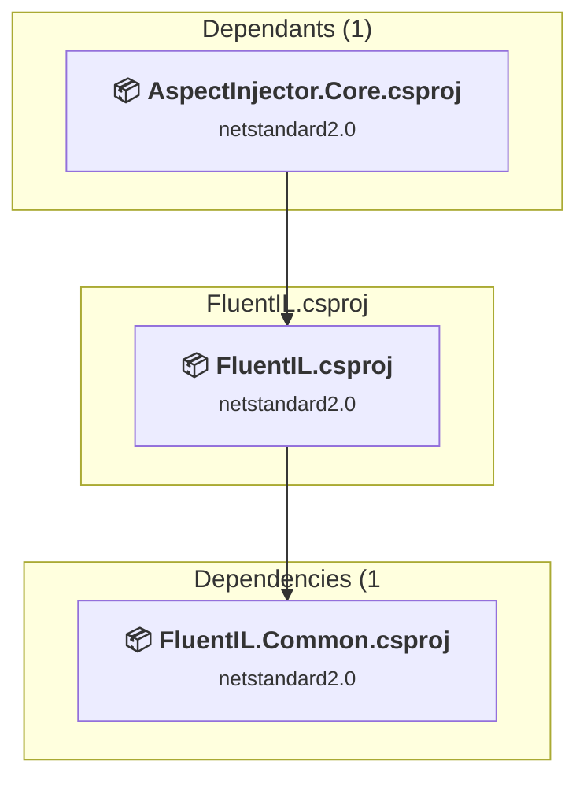
```mermaid
flowchart TB
    subgraph upstream["Dependants (1)"]
        P1["<b>📦&nbsp;AspectInjector.Core.csproj</b><br/><small>netstandard2.0</small>"]
        click P1 "#srcaspectinjectorcoreaspectinjectorcorecsproj"
    end
    subgraph current["FluentIL.csproj"]
        MAIN["<b>📦&nbsp;FluentIL.csproj</b><br/><small>netstandard2.0</small>"]
        click MAIN "#srcfluentilfluentilcsproj"
    end
    subgraph downstream["Dependencies (1"]
        P12["<b>📦&nbsp;FluentIL.Common.csproj</b><br/><small>netstandard2.0</small>"]
        click P12 "#srcfluentilcommonfluentilcommoncsproj"
    end
    P1 --> MAIN
    MAIN --> P12

```

### API Compatibility

| Category | Count | Impact |
| :--- | :---: | :--- |
| 🔴 Binary Incompatible | 0 | High - Require code changes |
| 🟡 Source Incompatible | 0 | Medium - Needs re-compilation and potential conflicting API error fixing |
| 🔵 Behavioral change | 0 | Low - Behavioral changes that may require testing at runtime |
| ✅ Compatible | 2339 |  |
| ***Total APIs Analyzed*** | ***2339*** |  |

### tests\AspectInjector.Analyzer.Tests\AspectInjector.Analyzer.Tests.csproj

#### Project Info

- **Current Target Framework:** net8.0
- **Proposed Target Framework:** net10.0
- **SDK-style**: True
- **Project Kind:** DotNetCoreApp
- **Dependencies**: 2
- **Dependants**: 0
- **Number of Files**: 16
- **Number of Files with Incidents**: 1
- **Lines of Code**: 1957
- **Estimated LOC to modify**: 0+ (at least 0.0% of the project)

#### Dependency Graph

Legend:
📦 SDK-style project
⚙️ Classic project

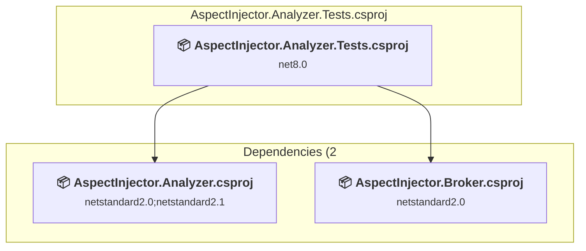
```mermaid
flowchart TB
    subgraph current["AspectInjector.Analyzer.Tests.csproj"]
        MAIN["<b>📦&nbsp;AspectInjector.Analyzer.Tests.csproj</b><br/><small>net8.0</small>"]
        click MAIN "#testsaspectinjectoranalyzertestsaspectinjectoranalyzertestscsproj"
    end
    subgraph downstream["Dependencies (2"]
        P8["<b>📦&nbsp;AspectInjector.Analyzer.csproj</b><br/><small>netstandard2.0;netstandard2.1</small>"]
        P4["<b>📦&nbsp;AspectInjector.Broker.csproj</b><br/><small>netstandard2.0</small>"]
        click P8 "#srcaspectinjectoranalyzeraspectinjectoranalyzercsproj"
        click P4 "#srcaspectinjectorbrokeraspectinjectorbrokercsproj"
    end
    MAIN --> P8
    MAIN --> P4

```

### API Compatibility

| Category | Count | Impact |
| :--- | :---: | :--- |
| 🔴 Binary Incompatible | 0 | High - Require code changes |
| 🟡 Source Incompatible | 0 | Medium - Needs re-compilation and potential conflicting API error fixing |
| 🔵 Behavioral change | 0 | Low - Behavioral changes that may require testing at runtime |
| ✅ Compatible | 1096 |  |
| ***Total APIs Analyzed*** | ***1096*** |  |

### tests\AspectInjector.Tests.Generics\AspectInjector.Tests.Generics.csproj

#### Project Info

- **Current Target Framework:** net8.0
- **Proposed Target Framework:** net10.0
- **SDK-style**: True
- **Project Kind:** ClassLibrary
- **Dependencies**: 2
- **Dependants**: 1
- **Number of Files**: 4
- **Number of Files with Incidents**: 1
- **Lines of Code**: 246
- **Estimated LOC to modify**: 0+ (at least 0.0% of the project)

#### Dependency Graph

Legend:
📦 SDK-style project
⚙️ Classic project

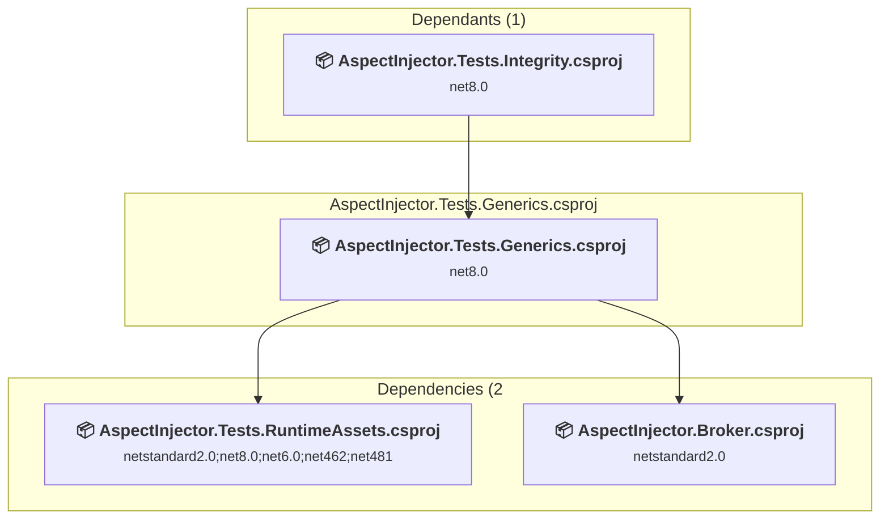
```mermaid
flowchart TB
    subgraph upstream["Dependants (1)"]
        P13["<b>📦&nbsp;AspectInjector.Tests.Integrity.csproj</b><br/><small>net8.0</small>"]
        click P13 "#testsaspectinjectortestsintegrityaspectinjectortestsintegritycsproj"
    end
    subgraph current["AspectInjector.Tests.Generics.csproj"]
        MAIN["<b>📦&nbsp;AspectInjector.Tests.Generics.csproj</b><br/><small>net8.0</small>"]
        click MAIN "#testsaspectinjectortestsgenericsaspectinjectortestsgenericscsproj"
    end
    subgraph downstream["Dependencies (2"]
        P5["<b>📦&nbsp;AspectInjector.Tests.RuntimeAssets.csproj</b><br/><small>netstandard2.0;net8.0;net6.0;net462;net481</small>"]
        P4["<b>📦&nbsp;AspectInjector.Broker.csproj</b><br/><small>netstandard2.0</small>"]
        click P5 "#testsaspectinjectortestsruntimeassetsaspectinjectortestsruntimeassetscsproj"
        click P4 "#srcaspectinjectorbrokeraspectinjectorbrokercsproj"
    end
    P13 --> MAIN
    MAIN --> P5
    MAIN --> P4

```

### API Compatibility

| Category | Count | Impact |
| :--- | :---: | :--- |
| 🔴 Binary Incompatible | 0 | High - Require code changes |
| 🟡 Source Incompatible | 0 | Medium - Needs re-compilation and potential conflicting API error fixing |
| 🔵 Behavioral change | 0 | Low - Behavioral changes that may require testing at runtime |
| ✅ Compatible | 49 |  |
| ***Total APIs Analyzed*** | ***49*** |  |

### tests\AspectInjector.Tests.Integrity\AspectInjector.Tests.Integrity.csproj

#### Project Info

- **Current Target Framework:** net8.0
- **Proposed Target Framework:** net10.0
- **SDK-style**: True
- **Project Kind:** DotNetCoreApp
- **Dependencies**: 4
- **Dependants**: 0
- **Number of Files**: 6
- **Number of Files with Incidents**: 1
- **Lines of Code**: 224
- **Estimated LOC to modify**: 0+ (at least 0.0% of the project)

#### Dependency Graph

Legend:
📦 SDK-style project
⚙️ Classic project

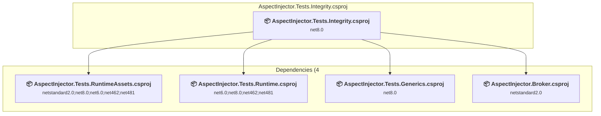
```mermaid
flowchart TB
    subgraph current["AspectInjector.Tests.Integrity.csproj"]
        MAIN["<b>📦&nbsp;AspectInjector.Tests.Integrity.csproj</b><br/><small>net8.0</small>"]
        click MAIN "#testsaspectinjectortestsintegrityaspectinjectortestsintegritycsproj"
    end
    subgraph downstream["Dependencies (4"]
        P5["<b>📦&nbsp;AspectInjector.Tests.RuntimeAssets.csproj</b><br/><small>netstandard2.0;net8.0;net6.0;net462;net481</small>"]
        P7["<b>📦&nbsp;AspectInjector.Tests.Runtime.csproj</b><br/><small>net6.0;net8.0;net462;net481</small>"]
        P14["<b>📦&nbsp;AspectInjector.Tests.Generics.csproj</b><br/><small>net8.0</small>"]
        P4["<b>📦&nbsp;AspectInjector.Broker.csproj</b><br/><small>netstandard2.0</small>"]
        click P5 "#testsaspectinjectortestsruntimeassetsaspectinjectortestsruntimeassetscsproj"
        click P7 "#testsaspectinjectortestsruntimeaspectinjectortestsruntimecsproj"
        click P14 "#testsaspectinjectortestsgenericsaspectinjectortestsgenericscsproj"
        click P4 "#srcaspectinjectorbrokeraspectinjectorbrokercsproj"
    end
    MAIN --> P5
    MAIN --> P7
    MAIN --> P14
    MAIN --> P4

```

### API Compatibility

| Category | Count | Impact |
| :--- | :---: | :--- |
| 🔴 Binary Incompatible | 0 | High - Require code changes |
| 🟡 Source Incompatible | 0 | Medium - Needs re-compilation and potential conflicting API error fixing |
| 🔵 Behavioral change | 0 | Low - Behavioral changes that may require testing at runtime |
| ✅ Compatible | 221 |  |
| ***Total APIs Analyzed*** | ***221*** |  |

### tests\AspectInjector.Tests.Runtime\AspectInjector.Tests.Runtime.csproj

#### Project Info

- **Current Target Framework:** net6.0;net8.0;net462;net481
- **Proposed Target Framework:** net6.0;net8.0;net462;net481;net10.0
- **SDK-style**: True
- **Project Kind:** ClassLibrary
- **Dependencies**: 2
- **Dependants**: 1
- **Number of Files**: 50
- **Number of Files with Incidents**: 1
- **Lines of Code**: 4616
- **Estimated LOC to modify**: 0+ (at least 0.0% of the project)

#### Dependency Graph

Legend:
📦 SDK-style project
⚙️ Classic project

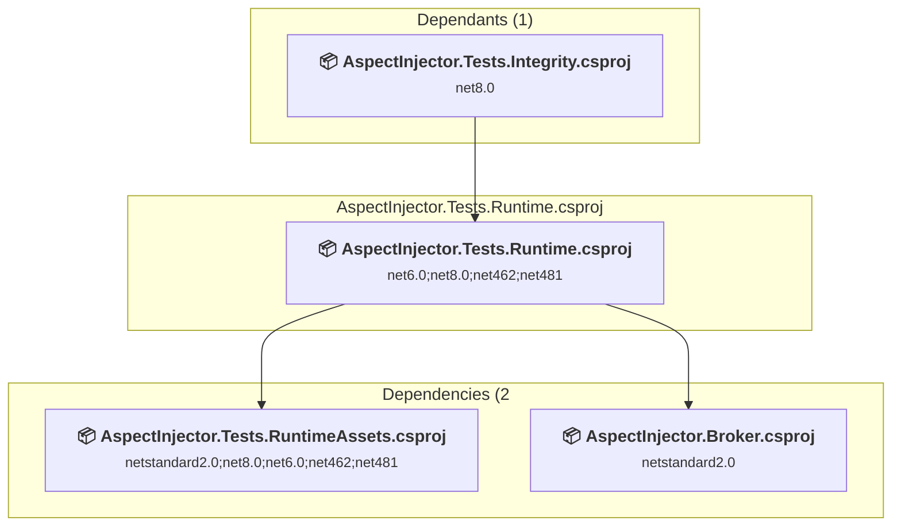
```mermaid
flowchart TB
    subgraph upstream["Dependants (1)"]
        P13["<b>📦&nbsp;AspectInjector.Tests.Integrity.csproj</b><br/><small>net8.0</small>"]
        click P13 "#testsaspectinjectortestsintegrityaspectinjectortestsintegritycsproj"
    end
    subgraph current["AspectInjector.Tests.Runtime.csproj"]
        MAIN["<b>📦&nbsp;AspectInjector.Tests.Runtime.csproj</b><br/><small>net6.0;net8.0;net462;net481</small>"]
        click MAIN "#testsaspectinjectortestsruntimeaspectinjectortestsruntimecsproj"
    end
    subgraph downstream["Dependencies (2"]
        P5["<b>📦&nbsp;AspectInjector.Tests.RuntimeAssets.csproj</b><br/><small>netstandard2.0;net8.0;net6.0;net462;net481</small>"]
        P4["<b>📦&nbsp;AspectInjector.Broker.csproj</b><br/><small>netstandard2.0</small>"]
        click P5 "#testsaspectinjectortestsruntimeassetsaspectinjectortestsruntimeassetscsproj"
        click P4 "#srcaspectinjectorbrokeraspectinjectorbrokercsproj"
    end
    P13 --> MAIN
    MAIN --> P5
    MAIN --> P4

```

### API Compatibility

| Category | Count | Impact |
| :--- | :---: | :--- |
| 🔴 Binary Incompatible | 0 | High - Require code changes |
| 🟡 Source Incompatible | 0 | Medium - Needs re-compilation and potential conflicting API error fixing |
| 🔵 Behavioral change | 0 | Low - Behavioral changes that may require testing at runtime |
| ✅ Compatible | 0 |  |
| ***Total APIs Analyzed*** | ***0*** |  |

### tests\AspectInjector.Tests.RuntimeAssets\AspectInjector.Tests.RuntimeAssets.csproj

#### Project Info

- **Current Target Framework:** netstandard2.0;net8.0;net6.0;net462;net481
- **Proposed Target Framework:** netstandard2.0;net8.0;net6.0;net462;net481;net10.0
- **SDK-style**: True
- **Project Kind:** ClassLibrary
- **Dependencies**: 1
- **Dependants**: 4
- **Number of Files**: 12
- **Number of Files with Incidents**: 1
- **Lines of Code**: 636
- **Estimated LOC to modify**: 0+ (at least 0.0% of the project)

#### Dependency Graph

Legend:
📦 SDK-style project
⚙️ Classic project

```mermaid
flowchart TB
    subgraph upstream["Dependants (4)"]
        P7["<b>📦&nbsp;AspectInjector.Tests.Runtime.csproj</b><br/><small>net6.0;net8.0;net462;net481</small>"]
        P13["<b>📦&nbsp;AspectInjector.Tests.Integrity.csproj</b><br/><small>net8.0</small>"]
        P14["<b>📦&nbsp;AspectInjector.Tests.Generics.csproj</b><br/><small>net8.0</small>"]
        P15["<b>📦&nbsp;AspectInjector.Tests.VBRuntime.vbproj</b><br/><small>net6.0;net8.0</small>"]
        click P7 "#testsaspectinjectortestsruntimeaspectinjectortestsruntimecsproj"
        click P13 "#testsaspectinjectortestsintegrityaspectinjectortestsintegritycsproj"
        click P14 "#testsaspectinjectortestsgenericsaspectinjectortestsgenericscsproj"
        click P15 "#testsaspectinjectortestsvbruntimeaspectinjectortestsvbruntimevbproj"
    end
    subgraph current["AspectInjector.Tests.RuntimeAssets.csproj"]
        MAIN["<b>📦&nbsp;AspectInjector.Tests.RuntimeAssets.csproj</b><br/><small>netstandard2.0;net8.0;net6.0;net462;net481</small>"]
        click MAIN "#testsaspectinjectortestsruntimeassetsaspectinjectortestsruntimeassetscsproj"
    end
    subgraph downstream["Dependencies (1"]
        P4["<b>📦&nbsp;AspectInjector.Broker.csproj</b><br/><small>netstandard2.0</small>"]
        click P4 "#srcaspectinjectorbrokeraspectinjectorbrokercsproj"
    end
    P7 --> MAIN
    P13 --> MAIN
    P14 --> MAIN
    P15 --> MAIN
    MAIN --> P4

```

### API Compatibility

| Category | Count | Impact |
| :--- | :---: | :--- |
| 🔴 Binary Incompatible | 0 | High - Require code changes |
| 🟡 Source Incompatible | 0 | Medium - Needs re-compilation and potential conflicting API error fixing |
| 🔵 Behavioral change | 0 | Low - Behavioral changes that may require testing at runtime |
| ✅ Compatible | 0 |  |
| ***Total APIs Analyzed*** | ***0*** |  |

### tests\AspectInjector.Tests.VBRuntime\AspectInjector.Tests.VBRuntime.vbproj

#### Project Info

- **Current Target Framework:** net6.0;net8.0
- **Proposed Target Framework:** net6.0;net8.0;net10.0
- **SDK-style**: True
- **Project Kind:** ClassLibrary
- **Dependencies**: 2
- **Dependants**: 0
- **Number of Files**: 1
- **Number of Files with Incidents**: 1
- **Lines of Code**: 42
- **Estimated LOC to modify**: 0+ (at least 0.0% of the project)

#### Dependency Graph

Legend:
📦 SDK-style project
⚙️ Classic project

```mermaid
flowchart TB
    subgraph current["AspectInjector.Tests.VBRuntime.vbproj"]
        MAIN["<b>📦&nbsp;AspectInjector.Tests.VBRuntime.vbproj</b><br/><small>net6.0;net8.0</small>"]
        click MAIN "#testsaspectinjectortestsvbruntimeaspectinjectortestsvbruntimevbproj"
    end
    subgraph downstream["Dependencies (2"]
        P5["<b>📦&nbsp;AspectInjector.Tests.RuntimeAssets.csproj</b><br/><small>netstandard2.0;net8.0;net6.0;net462;net481</small>"]
        P4["<b>📦&nbsp;AspectInjector.Broker.csproj</b><br/><small>netstandard2.0</small>"]
        click P5 "#testsaspectinjectortestsruntimeassetsaspectinjectortestsruntimeassetscsproj"
        click P4 "#srcaspectinjectorbrokeraspectinjectorbrokercsproj"
    end
    MAIN --> P5
    MAIN --> P4

```

### API Compatibility

| Category | Count | Impact |
| :--- | :---: | :--- |
| 🔴 Binary Incompatible | 0 | High - Require code changes |
| 🟡 Source Incompatible | 0 | Medium - Needs re-compilation and potential conflicting API error fixing |
| 🔵 Behavioral change | 0 | Low - Behavioral changes that may require testing at runtime |
| ✅ Compatible | 0 |  |
| ***Total APIs Analyzed*** | ***0*** |  |

### tests\Aspects.Tests\Aspects.Tests.csproj

#### Project Info

- **Current Target Framework:** net8.0
- **Proposed Target Framework:** net10.0
- **SDK-style**: True
- **Project Kind:** DotNetCoreApp
- **Dependencies**: 5
- **Dependants**: 0
- **Number of Files**: 8
- **Number of Files with Incidents**: 1
- **Lines of Code**: 722
- **Estimated LOC to modify**: 0+ (at least 0.0% of the project)

#### Dependency Graph

Legend:
📦 SDK-style project
⚙️ Classic project

```mermaid
flowchart TB
    subgraph current["Aspects.Tests.csproj"]
        MAIN["<b>📦&nbsp;Aspects.Tests.csproj</b><br/><small>net8.0</small>"]
        click MAIN "#testsaspectstestsaspectstestscsproj"
    end
    subgraph downstream["Dependencies (5"]
        P17["<b>📦&nbsp;Aspects.Lazy.csproj</b><br/><small>netstandard2.0</small>"]
        P19["<b>📦&nbsp;Aspects.Cache.csproj</b><br/><small>netstandard2.0</small>"]
        P21["<b>📦&nbsp;Aspects.Notify.csproj</b><br/><small>netstandard2.0</small>"]
        P4["<b>📦&nbsp;AspectInjector.Broker.csproj</b><br/><small>netstandard2.0</small>"]
        P18["<b>📦&nbsp;Aspects.Freezable.csproj</b><br/><small>netstandard2.0</small>"]
        click P17 "#aspectslazyaspectslazycsproj"
        click P19 "#aspectscacheaspectscachecsproj"
        click P21 "#aspectsnotifyaspectsnotifycsproj"
        click P4 "#srcaspectinjectorbrokeraspectinjectorbrokercsproj"
        click P18 "#aspectsfreezableaspectsfreezablecsproj"
    end
    MAIN --> P17
    MAIN --> P19
    MAIN --> P21
    MAIN --> P4
    MAIN --> P18

```

### API Compatibility

| Category | Count | Impact |
| :--- | :---: | :--- |
| 🔴 Binary Incompatible | 0 | High - Require code changes |
| 🟡 Source Incompatible | 0 | Medium - Needs re-compilation and potential conflicting API error fixing |
| 🔵 Behavioral change | 0 | Low - Behavioral changes that may require testing at runtime |
| ✅ Compatible | 402 |  |
| ***Total APIs Analyzed*** | ***402*** |  |

